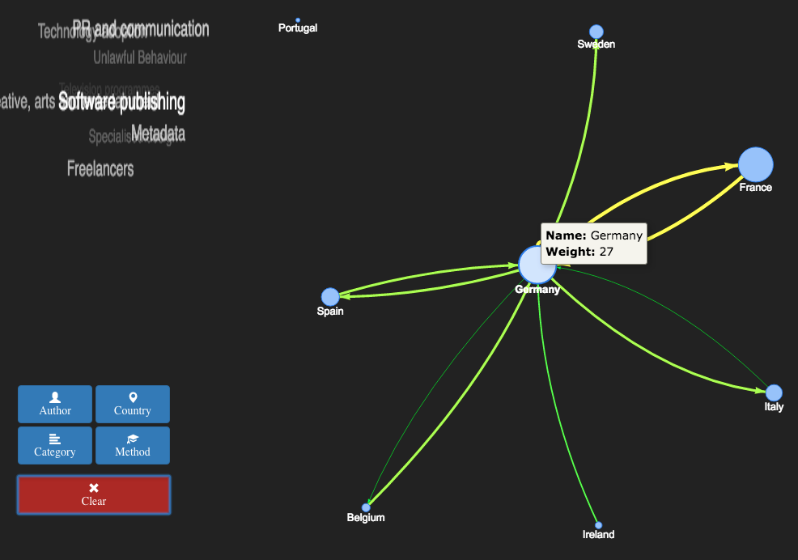

# Foobar project

## Introduction

We decided to improve the visualisation tools currently available at the wiki by
developing two new features:

 * Ability to group by several criteria: country, author, terms/tags...
 * For each of the nodes of these network graphs, show which terms are more 'relevant'

## Grouping studies

Visualisation tools right now don't have support from grouping studies.

We tought about which kind of ¿filters? would be most useful to copyright policy
makers and we came up with the following:

### By Country

With this visualisation we can discover the following info:

* The width of the arrow which connects countries A and B is proportional to the
  number of studies from A referencing studies from B. This shows us which
  countries quote which.
* The *tag cloud* shows which **topics** are treated more often in the studies
  released in this country.

### By Author

With this visualisation we can discover the following info:

* The width of the arrow which connects authors A and B is proportional to the
  number of studies published by A referencing studies published by B.
  This helps discover which authors quote which, who collaborates together in
  studies, etc. This authors may also work in the same topics...

* The *tag cloud* shows the topics each author is more interested in...

### By Categories, Topics, Tags, Terms...

Conclusions that can be extracted from the graph-style visualisation:

* Lets you discover which topics are related (since they reference each other)

Conclusions that can be extracted from the tag cloud:

* Authors that write about these topics
