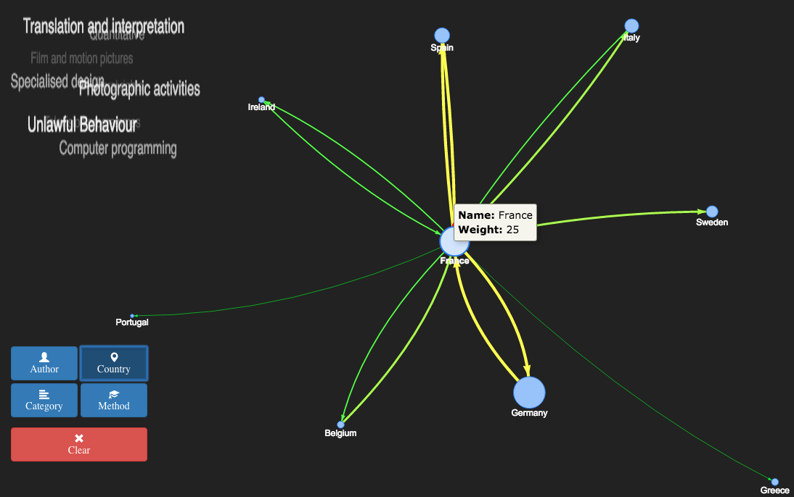

# Foobar project

This project was developed during the euHackathon 2016, whose objective was to
develop tools related to the visualisation of copyright evidence and/or enhance
the [Copyright Wiki](http://www.copyrightevidence.org/evidence-wiki/index.php/Copyright_Evidence).

There were several sites which served as data sources for developing these
visualisations. In addition to the already mentioned
[Copyright Wiki](http://www.copyrightevidence.org/evidence-wiki/index.php/Copyright_Evidence)
we also had a collection of studies at the euHackathon
[resources page](http://2016.euhackathon.eu/resources/).

## 1. Introduction

We decided to improve the visualisation tools currently available at the wiki by
developing two new features:

* Visualise copyright studies with the ability to group them by several criteria.
* For each of the resulting nodes of these diagrams, display a *tag cloud* which
  contains the most mentioned *topics* inside the studies that made up these nodes.

## 2. Grouping studies

Visualisation tools right now don't have support for grouping studies.

When we tought about which kind of grouping criteria would be most useful to
copyright policy makers we came up with the following:

* Grouping by **country**
* Grouping by **author**
* Grouping by **categories**

This is the final result of our work:

### 2.1. Grouping by country

With this visualisation we can discover the following info:

* The width of the arrow which connects countries A and B is proportional to the
  number of studies from A referencing studies from B. This shows us which
  countries quote which.
* The *tag cloud* shows which **topics** are treated more often in the studies
  released in this country.

### 2.2. Grouping by author

With this visualisation we can discover the following info:

* The width of the arrow which connects authors A and B is proportional to the
  number of studies published by A referencing studies published by B.
  This helps discover which authors quote which, who collaborates together in
  studies, etc. This authors may also work in the same topics...

* The *tag cloud* shows the topics each author is more interested in...

### 2.3. Grouping by category

Conclusions that can be extracted from the graph-style visualisation:

* Lets you discover which topics are related (since they reference each other)

Conclusions that can be extracted from the tag cloud:

* Authors that write about these topics
